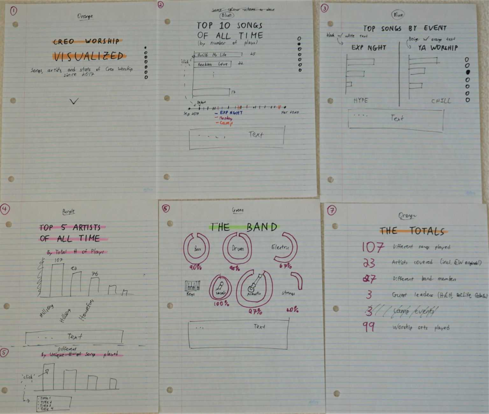
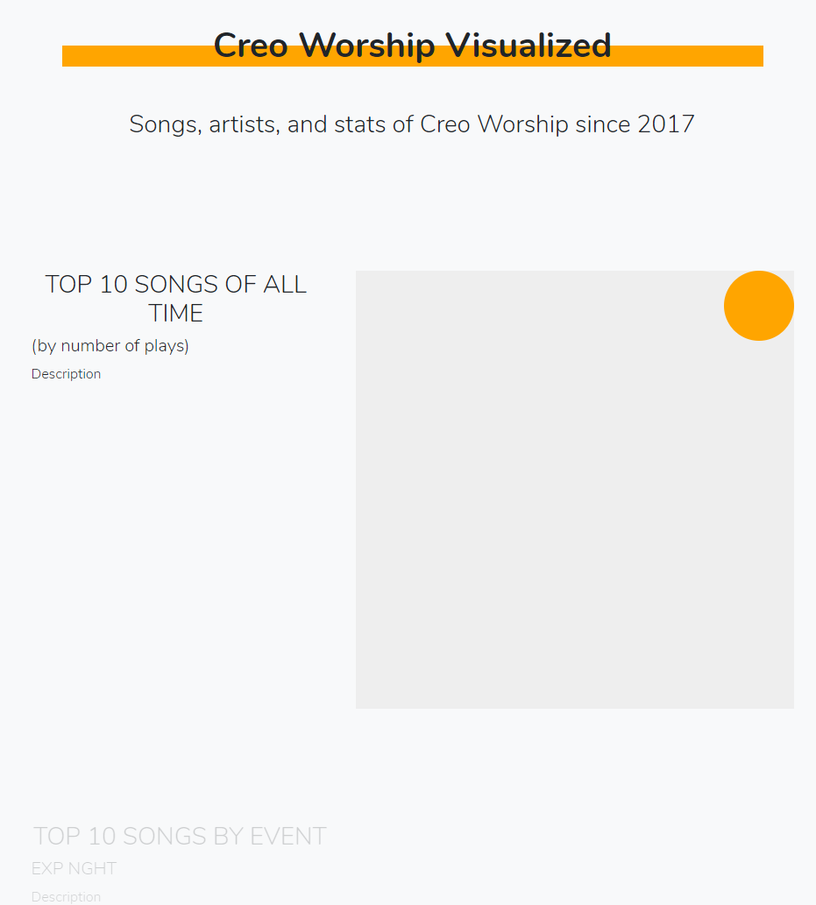
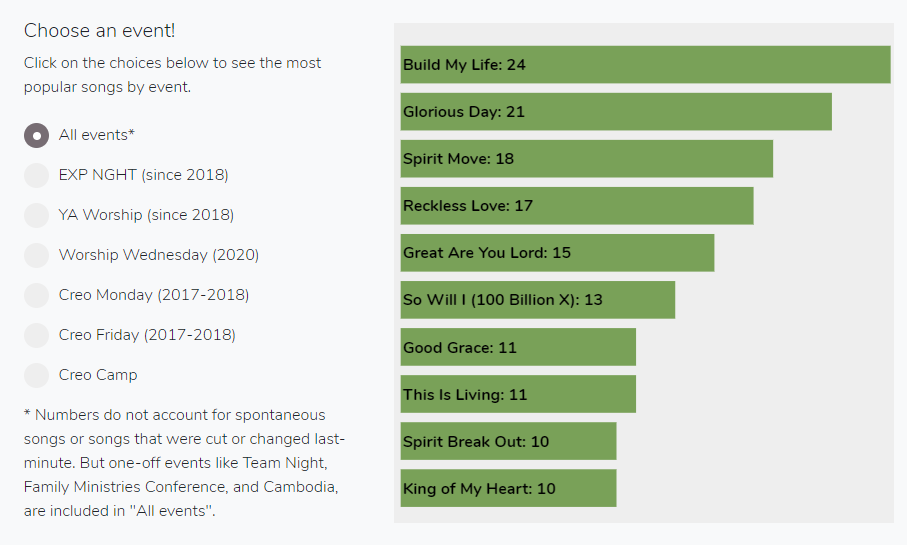
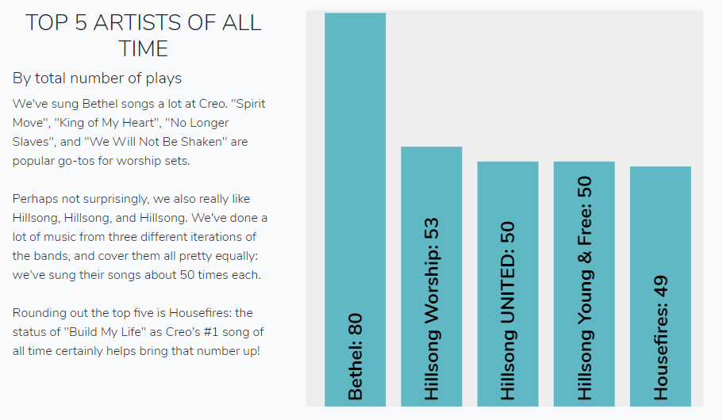
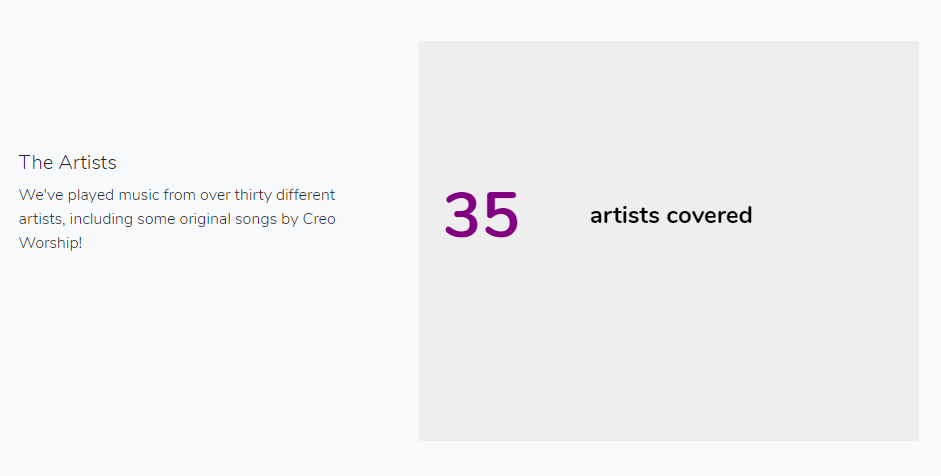
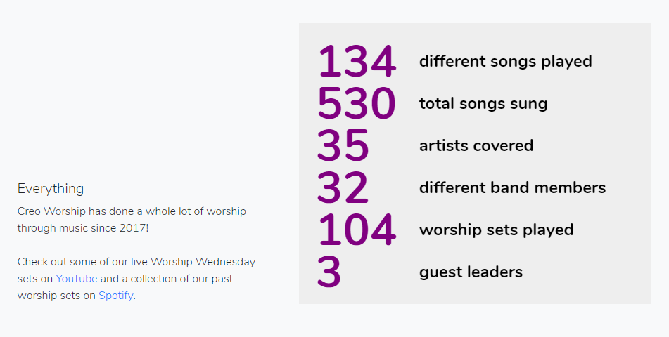

# Creo Worship Visualized
A data vis project in d3 for Creo Worship.  This is my dev diary.  For the live site, visit https://jordanmchiu.github.io/creo-worship-visualized/

## Background
This project was started in April 2020 as a personal data visualization project.  Built entirely using JavaScript (d3, crossfilter, graph-scroll), HTML, and CSS, it shows (hopefully) interesting statistics on [Creo Worship](http://www.creopeople.ca/) and the songs and artists we've covered since Fall 2017.

"But wait!"  I hear you ask.  "Why not build an actual API with a proper back-end?"  Well, this was a fairly small project, and I knew that keeping everything in plain JavaScript would probably the easiest thing for me to maintain in the long run.  If I set everything up properly, the only thing that I would need to update were the CSV files representing each event or song played.

This project will be hosted on GitHub Pages when it is complete, likely by late April or early May.

## Foundations
I decided to set up the project purely as an SPA with no back-end because I primarily wanted to play around with the d3 techniques I had learned in a datavis class I took at the University of British Columbia, CPSC 436V.  I knew that I wanted to push myself a bit beyond what we had done before in that class, and I was attracted to the "scrollytelling" approach of examples seen all over the web.  Scrollytelling was an effective way to convey a narrative with minimal interactive burden on the user, and I knew that my target audience (i.e. Creo Worship) would appreciate something they could access on any platform, whether PC or mobile.

I started by sketching out some of the ideas and charts that I wanted to create.  Obviously the fine details were something to be left out of the picture at this point, but the main points of the story were there:



## Technologies
Next, I had to figure out which technologies I wanted to use for scrollytelling.  After doing some searching, I went with [The Pudding's](https://pudding.cool/process/how-to-implement-scrollytelling/) suggestion of using [`graph-scroll`](https://1wheel.github.io/graph-scroll/) by Adam Pearce.  It's a d3 plugin based on [stack](https://github.com/mbostock/stack) by Mike Bostock, and helps dispatch events as the user scrolls to different sections on the webpage.

Using this template was a bit tricky, though.  For one, the main HTML page of `graph-scroll`'s main example seemed to use class names for IDs and vice versa - there were several elements with the same `container` or `sections` id, while class names were unique.  Secondly, everything was placed into a single file for the provided demo, and I had to separate all the functions of different components into separate classes.  Finally, the demo used d3v4, and I was most familiar with d3v5.

After spending some time tidying up the code and scaffolding the project, I had a very preliminary working outline that I could play around with and use as a base for my visualizations:



For data manipulation, I decided to go with [crossfilter](http://square.github.io/crossfilter/), a JS library used primarily for fast and multidimensional filtering.  While I wasn't necessarily using coordinated views to show my data, I was drawn to the fast and simple API calls that crossfilter provided for filtering and aggregation of tabular data, explained very well by [Animated Data](https://www.animateddata.com/articles/crossfilter/).

## Deriving Data
I had all the necessary technologies.  And before visualizing the data that I wanted, I had to first get and derive the data that I wanted to visualize.  I knew that, at the very least, I wanted to push all the functionality of manipulating and deriving data into its own class, so I pushed that functionality into a separate object that was constructed before the visualizations were set up.  Here's what `main.js` looked like:

```javascript
dataObject = new DataObject([
  './data/creo_worship_data.csv',
  './data/creo_worship_events.csv'
]);

dataObject.initialize().then(msg => {
  setup();
});
```

And the `dataObject` class:
```javascript
class DataObject {
  constructor(files) {
    this.fileNames = files;
    this.songData = null;
    this.eventData = null;
    this.songsCrossfilter = null;
    this.eventsCrossfilter = null;
  }

  // Initialize our data object with the given file names
  // Resolve when done to allow .then() on the top level
  initialize() {
    let dObj = this;

    return new Promise((resolve, reject) => {
      Promise.all([
        d3.csv(dObj.fileNames[0]),
        d3.csv(dObj.fileNames[1])
      ]).then(files => {
        dObj.songData = files[0];
        dObj.eventData = files[1];

        // Merge all the event data into song data for easier manipulation
        dObj.songData = dObj.songData.map((item) => {
          let event = dObj.eventData.find(d => d.date === item.date);
          if (event) { return Object.assign(item, event); }
        });

        // Clean song data
        dObj.songData.forEach(d => {
          d.date = new Date(d.date);
          d.response = (d.response === '1');
        });

        // Clean event data
        dObj.eventData.forEach(d => {
          d.date = new Date(d.date);
        });

        // Construct crossfilters for all data objects for easier and efficient manipulation
        dObj.songsCrossfilter = crossfilter(dObj.songData);
        dObj.eventsCrossfilter = crossfilter(dObj.eventData);

        resolve('initialized');
      });
    });
  }
  ...
}
```

Now all I had to do was create API-like calls to this class to get the data that I wanted for my visualization.  Here's an example of what a method call looked like if I wanted to get the top 10 songs by a given event, say, a YA Worship Night:
```javascript
// Return the top ten songs for the given event
// eventName is either:
// - 'exp_nght'
// - 'ya_worship'
// - 'camp'
// - 'creo_monday'
// - 'creo_friday'
// If eventName doesn't exist, you'll get an empty array
getTopTenSongsByEvent(eventName) {
  let dObj = this;

  // Set up a filter by event name
  let eventDimension = dObj.songsCrossfilter.dimension(d => d.event);
  eventDimension.filter(d => d === eventName);

  let songNameDimension = dObj.songsCrossfilter.dimension(d => d.song_name);
  let songNameGroup = songNameDimension.group();

  // Create a copy of the top ten songs so you don't reference the same array of objects
  // Once you clear the filter below, you'll get weird numbers if you don't do this.
  let ret = [];
  songNameGroup.top(10).forEach(d => {
    if (d.value > 0) ret.push({...d});
  });

  // Clear filters
  eventDimension.filterAll();

  return ret;
}
```

Note that in this use of crossfilter, I had to do two things:
1. Copy the results from the array I wanted to return to prevent any reference errors that might come up.
2. Remove the filter on the existing crossfilter by calling `eventDimension.filterAll()` before returning.  Because crossfilter is meant to be used among multiple views, filters remain in place until they are removed.

I later moved the creation of crossfilter dimensions to the `initialize()` method, since creating dimensions is computationally expensive:

```javascript
// Set up dimensions for crossfilter once, because setting up dimensions is expensive
dObj.songNameDimension   = dObj.songsCrossfilter.dimension(d => d.song_name);    
dObj.artistNameDimension = dObj.songsCrossfilter.dimension(d => d.song_artist);
dObj.eventDimension      = dObj.songsCrossfilter.dimension(d => d.event);
```

While I was able to answer most of my queries using crossfilter, there were a few queries that I needed to brute-force.  Namely, counting the number of band members that Creo Worship has ever had, and the number of different events that had different roles present (like the number of events that had strings players or backing vocalists).  However, I will highlight only the most complex query: the top ten artists of all time by the number of different songs played.

Crossfilter doesn't allow grouping along different dimensions, so I decided to support this by setting up a few data structures upon construction of the data object.  I needed to construct an object with the following structure:
```javascript
{
  artist_name: [song_name_1, song_name_2, ...],
  artist_name: [song_name_1, ...]
}
```
After this object was constructed, I could then iterate through each key:value pair and produce an array with the following values:
```javascript
[
  {key: artist_name, value: song_count},
  ...
]
```
This array could easily be sorted afterwards.  Thie final implementation of this construction involved two helper methods that were called in `initialize()`:

```javascript
setupArtistsAndSongs(d) {
  let dObj = this;
  let artist = d.song_artist;
  if (!dObj.artistsAndSongs.hasOwnProperty(artist)) {
    dObj.artistsAndSongs[artist] = [];
  }
  if (!dObj.artistsAndSongs[artist].includes(d.song_name)) {
    dObj.artistsAndSongs[artist].push(d.song_name);
  }
}

setupArtistsAndSongsCounts() {
  let dObj = this;
  for (let a of Object.keys(dObj.artistsAndSongs)) {
    dObj.artistsAndSongsCounts.push({
      key: a,
      value: dObj.artistsAndSongs[a].length
    });
  }
  dObj.artistsAndSongsCounts = dObj.artistsAndSongsCounts.sort((a, b) => b.value - a.value);
}
```

## The Song and Artists Charts
Now that I had built up all the back-end data objects that I needed, it was time to start on the charts themselves.  I knew that I wanted to start with a simple bar chart to work with the songs data: the top ten songs of all time by number of times sung (with an optional event parameter to filter by).

This was a fairly simple bar chart to implement.  I knew that I just wanted 10 songs to be displayed at one time, and there was no need for axis labels given that the data would be displayed directly on the chart in the format "Song Name: Number_of_plays".

The trickiest part was figuring out how to facilitate both automated scrollytelling (where the data would change dynamically depending on which paragraph was active at the time) and the user's ability to select an event to filter by (the final stop along this scrollytelling journey).  I ended up creating an event listener using jQuery that would force the chart to identify which event was selected at a given time when the user made a selection.  First, I would set two internal variables to be `null` upon selection in `main.js`:
```javascript
$(document).ready(function()
{
  $("#form-event-selector").change(function()
  {
    songsChart.selectedEvent = null;
    songsChart.internalIndex = null;
    songsChart.update();
  });
});
```
Then I would update the internal variables in the `update()` method of `songsChart.js`:
```javascript
if (!vis.selectedEvent) {
  vis.selectedEvent = $("input[name='event-selector']:checked").val();
}
if (!vis.internalIndex) {
  vis.internalIndex = vis.events.indexOf(vis.selectedEvent);
} 
```

I now had a working, responsive bar chart for songs!



I did a very similar thing for the top artists as well, but made this chart a vertical bar chart for variety:



## The Totals

I knew that the donut charts related to the percentage composition of worship bands was going to be the most difficult element, so I wanted to start with a simpler element first: the "totals" data summary that showed up at the very bottom of the page.  

I knew that I wanted the numbers to only appear as the user scrolled across different sections that elaborated on each of those numbers a bit.  I also wanted to make all the numbers visible when the user scrolled to the very bottom of the page.

By placing all of the dynamically-generated text inside an SVG element, I was able to use d3 to control the spacing and opacity of the text using scroll events:

```javascript
// Spacing with scalePoint:
vis.yScale = d3.scalePoint()
  .domain(vis.activeSections)
  .range([0 + m.top * 5, vis.height - m.bottom * 5]);

// Rendering numbers on the svg:
summaryNumber.enter().append('text')
  .merge(summaryNumber)
    .attr('class', 'summary-text-number')
    .attr('text-anchor', 'left')
    .attr('x', 20)
    .attr('y', (d, i) => vis.yScale(vis.activeSections[i]))
    .attr('dy', '.35em')
    .text((d, i) => vis.numbersToRender[i])
  .transition().duration(500)
    .style('opacity', (d, i) => vis.getOpacity(d,i));
```

Now, only specific lines of text would be visible when scrolling through the first few sections:



And all the text would be visible at the bottom of the page:



## The Band Chart


## Scratchpad
Sources:
- Textures for d3: https://riccardoscalco.it/textures/
- So You Want to Build A Scroller: https://vallandingham.me/scroller.html
- Waypoints (trigger a function when scrolling to an element): http://imakewebthings.com/waypoints/
- Graph-scroll, a d3 plugin: https://1wheel.github.io/graph-scroll/
- Implementing scrollytelling: https://pudding.cool/process/how-to-implement-scrollytelling/

Things to use:
- Font family: Nunito: https://fonts.google.com/specimen/Nunito
- Scrolling library: graph-scroll
- Layouts: bootstrap